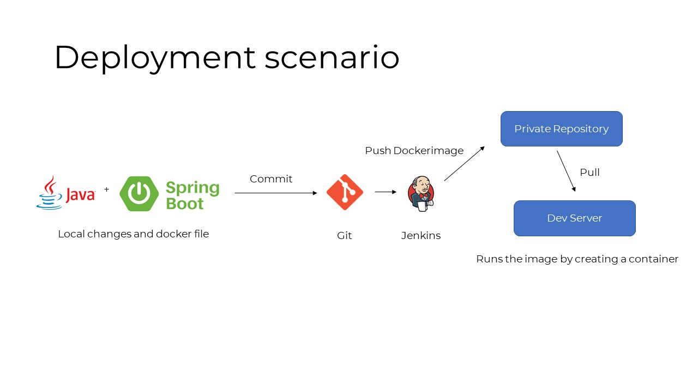
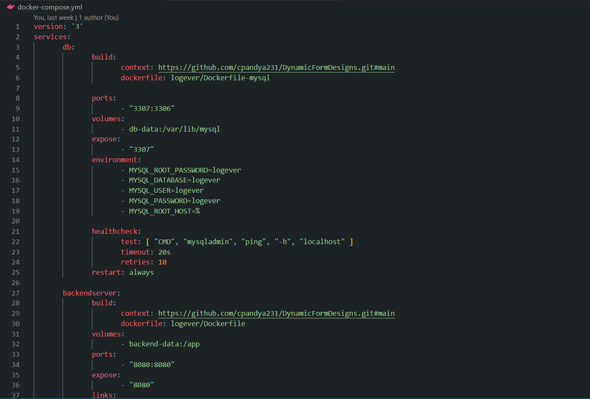

# Docker Concepts

## Containers

#### 1. Benefits of a container
- A container is a layer of images stacked on top of one another. At the base of the image is linux alpine and layers are added on top of it.

#### 2. Benefits of a container
- Container is a way to package entire application so that it has all the dependencies, build files. 
- This way of packaging is portable, which means it just needs to be setup only once and then can be shared between **developers and devops** teams.
- Containers are stored in forms of image inside public repository like [DockerHub](https://hub.docker.com/) or can be private repo of a company.

#### 3. Difference between Container and Image
- When package an application or share it among people, you actually share the image.

- But when you run the image, it gets converted into a container.

#### 4. Docker vs Virtual Machine
- Docker images are lightweight 
- They are quick to run

Docker | Virtual Machine | 
--- | --- | ---
Applications | Applications
If host does not suppprt Linux then we need to install toolbox that abstracts OS Kernal| Has its own OS Kernal

## Accessing containers from Host

- When you run a container using  `docker run`, it needs to be attached to the actual port of host machine, otherwise you can't access it.
- Example:

   `docker run -d -p 9000:8081 [image-name]`

## Real-life deployment process

## Docker networks

- When we have multilple docker containers (**i.e Backend Server and DB**) and they need to communicate we should use docker network
- By specifically putting multiple containers under a same network they will be able to talk just by using the container name (no need to provide localhost or any other ip)

- Example:

  >  `docker network create mysql-network`
  > `docker run -d  ---name custom-mysql --net mysql-network mysql`
  > `docker run -d -p 8081:8081 ---name java-app --net mysql-network java:latest`

## Docker commands

#### `docker pull [image-name]`
- Pulls the image from public/private repository

#### `docker run -d [image-name]`
- Runs the image by creating a container (in detached mode)

#### `docker ps`
- Gives status of all running containers

#### `docker stop [container-id]`
- Stops a running container

#### `docker start [container-id]`
- Starts already created container which was stopped

#### `docker logs -f [container-id]`
- To check the logs and follow it continuously 

#### `docker exec -it [container-id] /bin/bash`
- To get inside the container and access the terminal

#### `docker build -t my-app:1.0 [location-of-dockerfile]`
- Build a custom image based on the dockerfile which you can create using [Dockerfile](#dockerfile)
- my-app:1.0 is the image name and version

#### `docker rm [container-name]`
- To delete container

#### `docker rmi [image-name]`
- To delete image

## Dockerfile
- Sample  Dockerfile
>FROM maven:3.6.0-jdk-11-slim AS build
COPY logever/pom.xml /app/
COPY logever/src /app/src
RUN mvn -f /app/pom.xml clean package -DskipTests

> FROM adoptopenjdk/openjdk11:latest
EXPOSE 8080
COPY /app/target/logever-0.0.1-SNAPSHOT.jar /app/confacai.jar
ENTRYPOINT ["java","-jar","-Dspring.profiles.active=container","/app/confacai.jar"] 

#### `FROM`
- To specify base image on top of which a new image to be created

#### `COPY`
- To copy from **HOST => Container**

#### `RUN `
- To run any linux command inside **Container**, there can be many RUN commands in a Dockerfile

#### `ENTRYPOINT`
- To run any linux command inside **Container**, but there will be only one ENTRYPOINT and usually it will be executed at the end

## Docker volumes
- When you create a container (ex: MYSQL) and delete it the data will not be preserved
- To preserve the data, we have to mount it to a folder in the host system
- There are 3 types of volumes
        - Anonumous volumes => Created by default 
        - Host Volumes  => You can provide custom path of the folder where volumes will be mounted but the name of the volume will be a sash
        - Named Volumes => You can provide name of the volumes (works well with Docker Compose)

## Docker Compose
- Docker compose is used to structure running docker containers
- If you have more than one docker containers like the example above, it is tedious to write all the commands to run the containers
- Docker compose uses a **yaml** file in which you can write all the of configuration and then run it with single command
> In case of  docker compose, you don't have to create a network and attach containers to it. It is handled by default

- Example:

## Docker Compose commands 

#### `docker compose up --build -d`
- Rebuilds containers and starts them in detached mode
