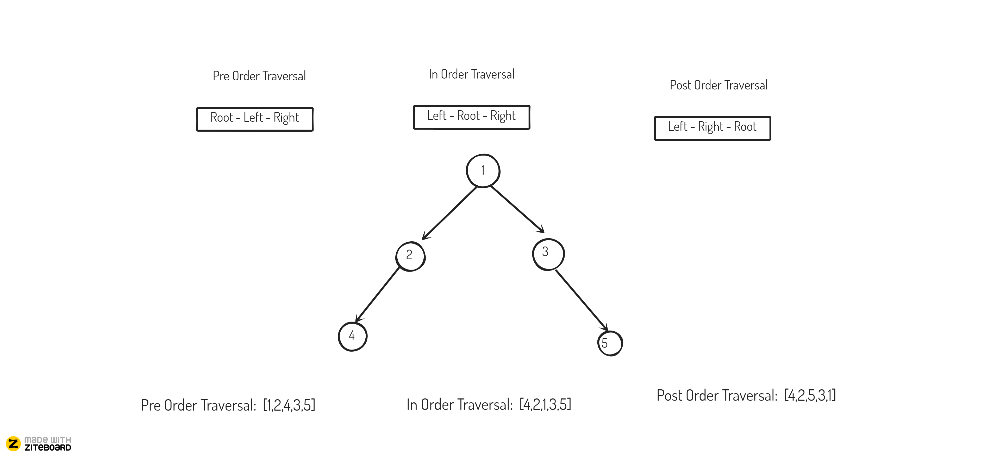

# Datastructures and Algorithms

## Algorithms

1. [Binary Search](#binary-search)
2. [Two Pointers](#two-pointers)
3. [Sliding Window](#sliding-window)
4. [Graph](#graph)
5. [Recursion](#recursion)
6. [Backtracking](#backtracking)
7. [Bit Manipulation](#bit-manipulation)
8. [Dynamic Programming](#dynamic-programming)

## Datastructures

1. [Array](#array)
2. [String](#string)
3. [LinkedList](#linkedlist)
4. [Stack](#stack)
5. [Queue](#queue)
6. [Tree](#tree)

### Binary Search

### Two Pointers

### Sliding Window

### Graph

### Recursion

### Backtracking

_Backtracking is used when you have to look for all possible solution and remove the solution that does not match the given criteria_

**Types of problems:**

- Search for any feasible solution
- Search for best feasible solution
- Search for all feasible solutions

**Actual problems:**

[N-Queens problem](https://leetcode.com/problems/n-queens/)
[Sudoku Solver](https://leetcode.com/problems/sudoku-solver/)

**Special note:**
Try to convert the problem statement into DFS graph. It will be easy to write recursion from it.

### Bit Manipulation

### Dynamic Programming

### Array

### String

### LinkedList

### Stack:

_LIFO or FILO type datastructure_

**Types of operations:**

- push
- pop
- peek
- isEmpty

All operations can be done in O(1)

**Custom implementation of Stack:**

    class Stack {
        static final int MAX = 1000;
        int top;
        int a[] = new int[MAX]; // Maximum size of Stack

        boolean isEmpty()
        {
            return (top < 0);
        }
        Stack()
        {
            top = -1;
        }

        boolean push(int x)
        {
            if (top >= (MAX - 1)) {
                System.out.println("Stack Overflow");
                return false;
            }
            else {
                a[++top] = x;
                System.out.println(x + " pushed into stack");
                return true;
            }
        }

        int pop()
        {
            if (top < 0) {
                System.out.println("Stack Underflow");
                return 0;
            }
            else {
                int x = a[top--];
                return x;
            }
        }

        int peek()
        {
            if (top < 0) {
                System.out.println("Stack Underflow");
                return 0;
            }
            else {
                int x = a[top];
                return x;
            }
        }

        void print(){
        for(int i = top;i>-1;i--){
        System.out.print(" "+ a[i]);
        }
    }
    }

    // Driver code
    class Main {
        public static void main(String args[])
        {
            Stack s = new Stack();
            s.push(10);
            s.push(20);
            s.push(30);
            System.out.println(s.pop() + " Popped from stack");
            System.out.println("Top element is :" + s.peek());
            System.out.print("Elements present in stack :");
            s.print();
        }
    }

### Queue

### Tree

